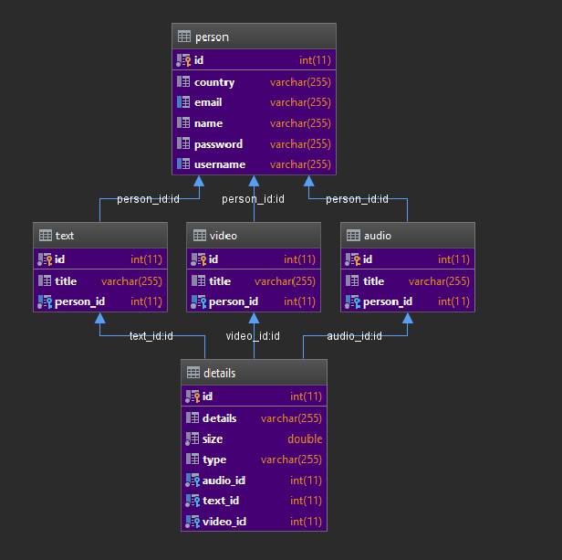

# VideoToText
This is a flask web application that converts users uploaded videos to text. The vidoes and text are stored in the database and can be accessed once logged in as an authenticated user.

## Requirements
- Create your virtual environment by running `virtualenv venv` 
- Activate the virtual environment:
1. For windows users -> `.\venv\Scripts\activate`
2. For mac users -> `source env/bin/activate`
- Once virtualenv has been acctivate. Run `pip install -r requirements.txt`. **NOTE** If you install a new package, make sure to run `pip freeze > requirements.txt`

## Database

## Run
- Run the applicate with `flask run` or `python app.py`
